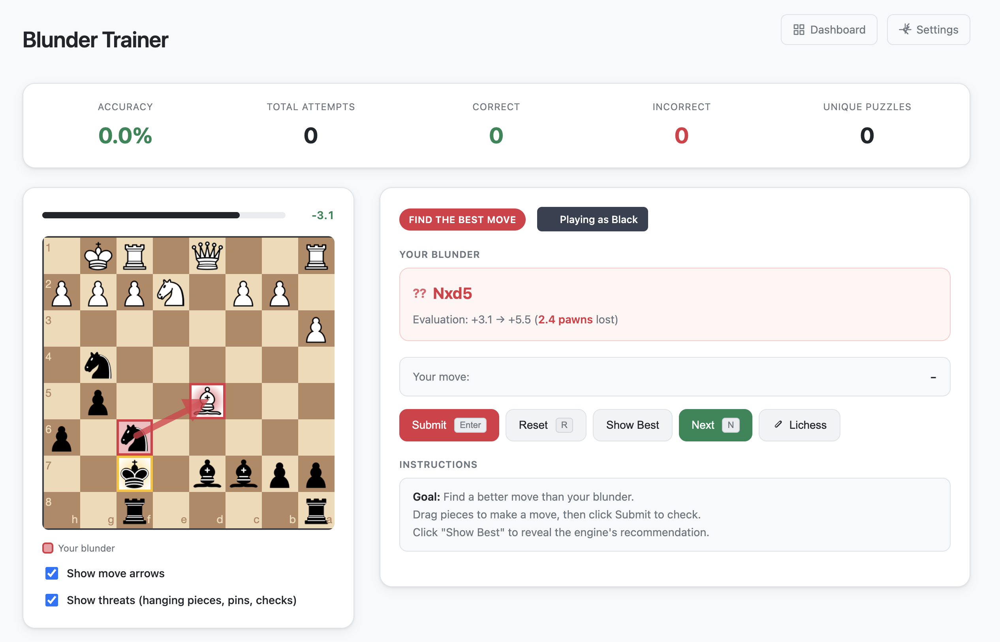

# TLDR;

Load your games from chess.com or lichess.org, run stockfish analysis and train over your past blunders.

## Self-Hosting with Docker

### Quick Start

1. Clone the repository
2. (Optional) Copy `.env.example` to `.env` and configure your usernames
3. Run: `docker-compose up -d`
4. Open: http://localhost:8000

If no environment variables are set, you'll see a setup screen on first run where you can configure your Lichess and/or Chess.com usernames.

### Configuration

The application can be configured through environment variables (see `.env.example`) or via the web UI:

- **Usernames**: Set `LICHESS_USERNAME` and/or `CHESSCOM_USERNAME` to skip the setup screen
- **Multi-platform**: Configure both usernames to merge puzzles from Lichess and Chess.com
- **Engine depth**: Adjust `STOCKFISH_DEPTH` (default: 14) for analysis quality vs speed
- **Auto-sync**: Set `AUTO_SYNC_ENABLED=true` to enable automatic game synchronization
- **Sync interval**: Set `SYNC_INTERVAL_HOURS=24` to control sync frequency (default: 24 hours)
- **Max games per sync**: Set `SYNC_MAX_GAMES=1000` to limit games fetched per sync

For detailed Docker documentation, see [DOCKER.md](DOCKER.md).

### Data Persistence

Game data and analysis are stored in the `./data` directory, which is mounted as a Docker volume. Your data persists across container restarts.

## Local Development Configuration

### Stockfish binary

By default the CLI uses `$STOCKFISH_BINARY` if set, otherwise falls back to
`stockfish` on your PATH. You can also pass `--engine-path` to override it.

## Glossary

- **[Stockfish](https://www.chessprogramming.org/Stockfish)**: Open-source chess engine used for game analysis
- **Blunder**: A serious mistake that loses significant material or positional advantage (typically ≥200 centipawns)
- **Mistake**: A moderate error that worsens your position (typically 100-200 centipawns)
- **Inaccuracy**: A minor suboptimal move (typically 50-100 centipawns)
- **[Centipawn](https://www.chessprogramming.org/Centipawns) (cp)**: Unit measuring position evaluation; 100 cp ≈ 1 pawn of advantage
- **[Depth](https://www.chessprogramming.org/Depth)**: How many half-moves (plies) ahead the engine calculates; higher = stronger but slower
- **[PGN](https://www.chessprogramming.org/Portable_Game_Notation)**: Portable Game Notation, standard text format for recording chess games
- **[SAN](https://www.chessprogramming.org/Algebraic_Chess_Notation#SAN)**: Standard Algebraic Notation, human-readable move format (e.g., `Nf3`, `e4`, `O-O`)
- **[UCI](https://www.chessprogramming.org/UCI)**: Universal Chess Interface, protocol for communicating with chess engines
