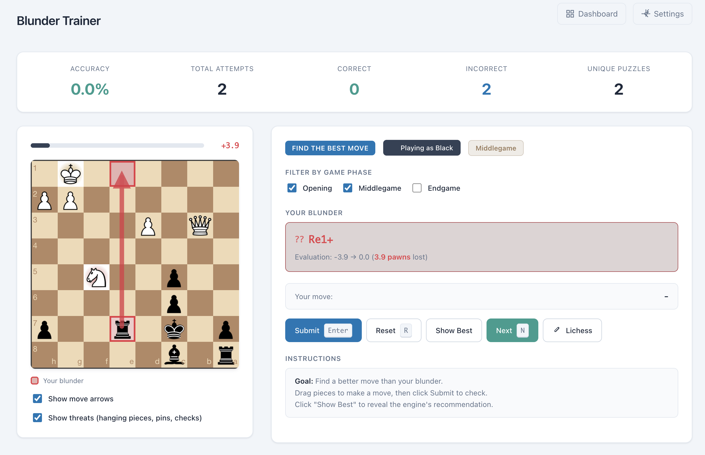
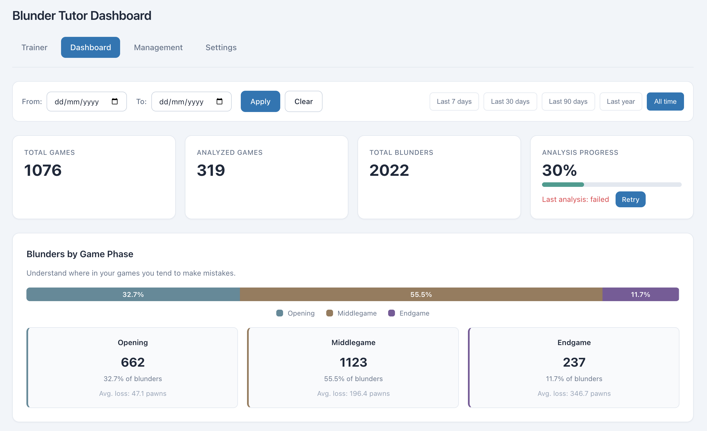
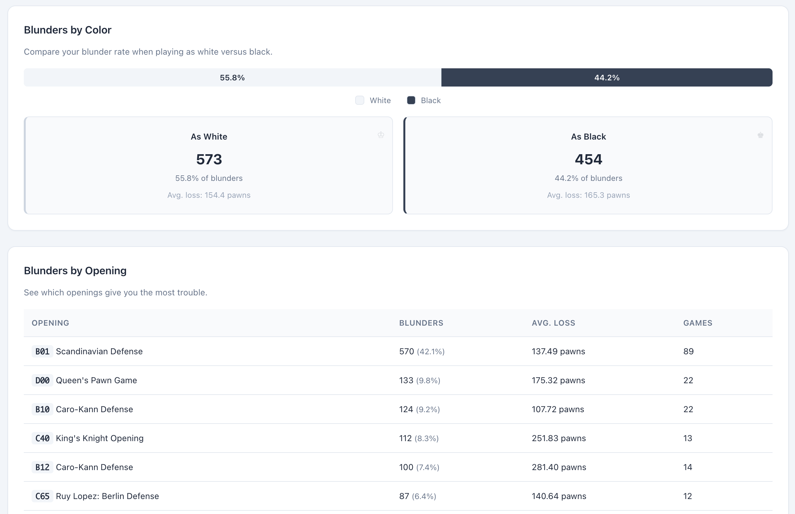

# Blunder Tutor

[](https://codecov.io/gh/MrLokans/chess-blunder-trainer)

**Learn from your mistakes.** Blunder Tutor imports your games from Chess.com and Lichess, analyzes them with Stockfish, and creates personalized puzzles from your actual blunders. Instead of practicing generic tactics, you train on the exact positions where you went wrong.

## Why Blunder Tutor?

Most chess players make the same types of mistakes repeatedly. Generic puzzle trainers help with pattern recognition, but they don't address *your* specific weaknesses. Blunder Tutor:

- **Targets your real weaknesses** — puzzles come from positions where you actually blundered
- **Tracks your progress** — see which mistake patterns you've corrected over time
- **Supports multiple platforms** — import games from both Lichess and Chess.com
- **Self-hosted** — your data stays on your machine, no accounts required

## Screenshots



| | |
|:-:|:-:|
|  |  |

## Quick Start

```bash
# Clone and run with Docker
git clone https://github.com/MrLokans/chess-blunder-trainer.git
cd chess-blunder-trainer
docker-compose up -d
```

Open http://localhost:8000 and enter your Lichess or Chess.com username to get started.

### Configuration

Set environment variables in `.env` (see `.env.example`):

| Variable | Description |
|----------|-------------|
| `LICHESS_USERNAME` | Your Lichess username |
| `CHESSCOM_USERNAME` | Your Chess.com username |
| `STOCKFISH_DEPTH` | Analysis depth (default: 14) |
| `AUTO_SYNC_ENABLED` | Enable automatic game sync |
| `SYNC_INTERVAL_HOURS` | Hours between syncs (default: 24) |

Game data persists in `./data` across restarts.

For advanced Docker options, see [DOCKER.md](DOCKER.md).

## Local Development

```bash
make install-dev    # Install dependencies
make test           # Run tests
make lint           # Check code style
uv run python main.py  # Start dev server
```

Requires Stockfish on your PATH or set `STOCKFISH_BINARY`.

## How It Works

1. **Fetch** — Downloads your recent games via Lichess/Chess.com APIs
2. **Analyze** — Stockfish evaluates every position to find blunders (≥200 centipawn loss)
3. **Train** — Practice the blundered positions as puzzles, with the engine's best move as the solution

## Links

- [Roadmap](ROADMAP.md)
- [Changelog](CHANGELOG.md)
- [Docker Documentation](DOCKER.md)

## Glossary

- **[Stockfish](https://www.chessprogramming.org/Stockfish)**: Open-source chess engine used for game analysis
- **Blunder**: A serious mistake that loses significant material or positional advantage (typically ≥200 centipawns)
- **Mistake**: A moderate error that worsens your position (typically 100-200 centipawns)
- **Inaccuracy**: A minor suboptimal move (typically 50-100 centipawns)
- **[Centipawn](https://www.chessprogramming.org/Centipawns) (cp)**: Unit measuring position evaluation; 100 cp ≈ 1 pawn of advantage
- **[Depth](https://www.chessprogramming.org/Depth)**: How many half-moves (plies) ahead the engine calculates; higher = stronger but slower
- **[PGN](https://www.chessprogramming.org/Portable_Game_Notation)**: Portable Game Notation, standard text format for recording chess games
- **[SAN](https://www.chessprogramming.org/Algebraic_Chess_Notation#SAN)**: Standard Algebraic Notation, human-readable move format (e.g., `Nf3`, `e4`, `O-O`)
- **[UCI](https://www.chessprogramming.org/UCI)**: Universal Chess Interface, protocol for communicating with chess engines
