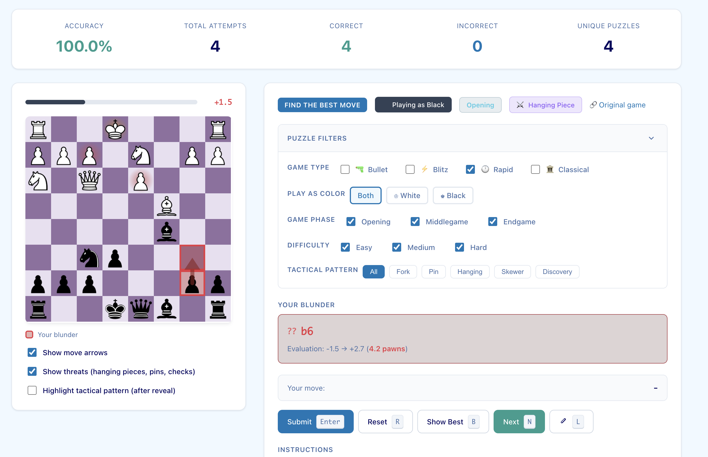
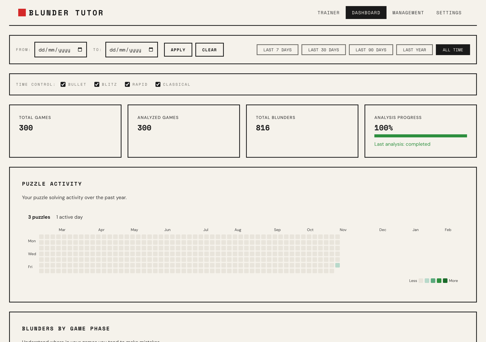
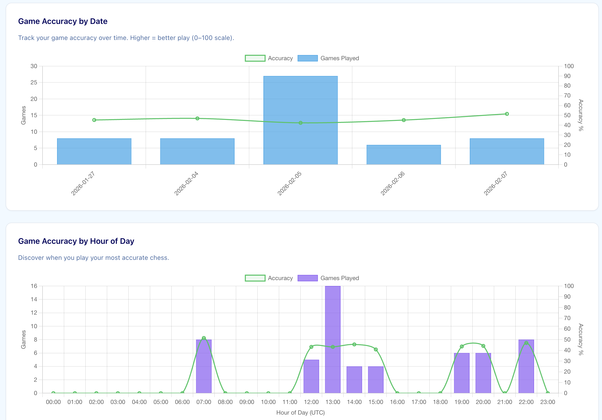
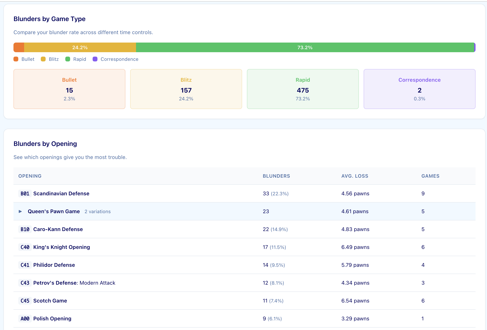
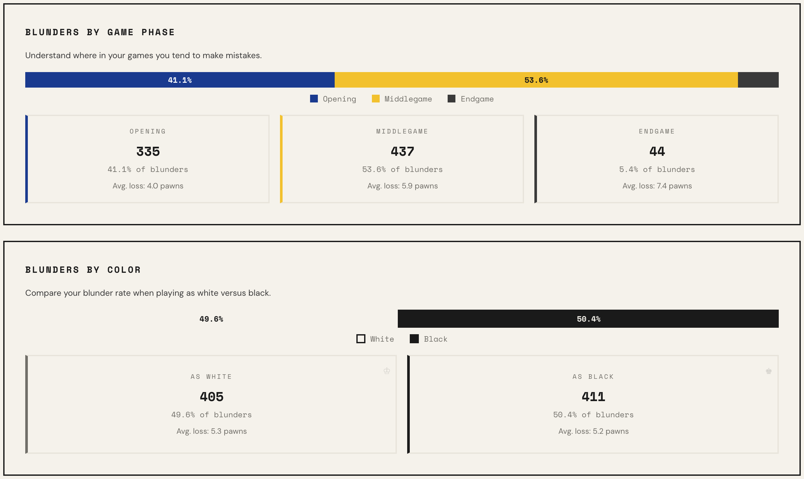
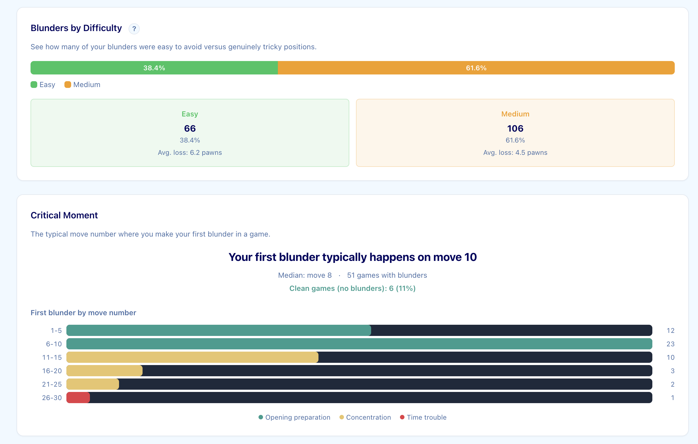
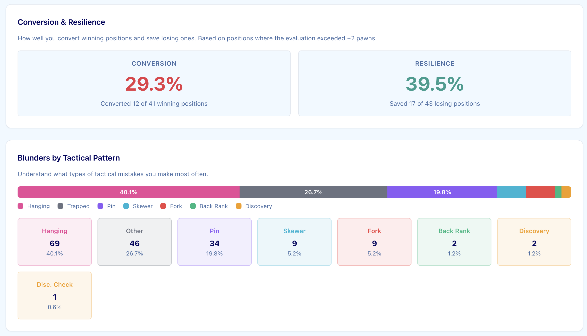
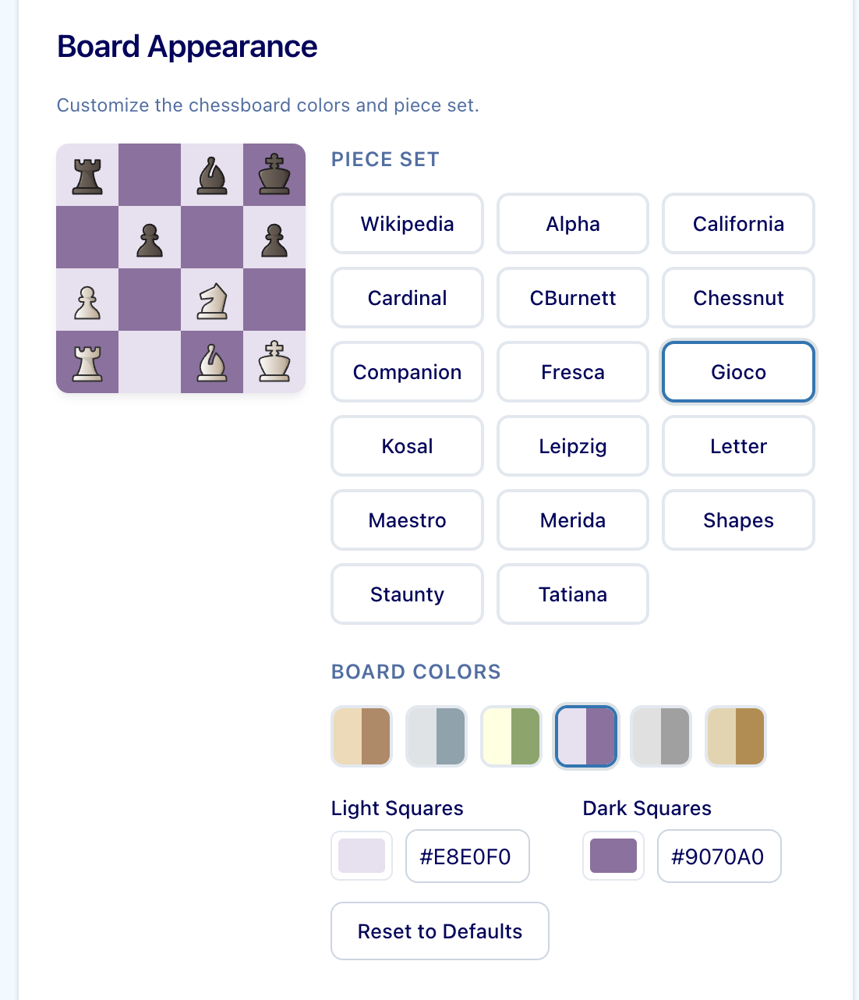

# Blunder Tutor

[](https://codecov.io/gh/MrLokans/chess-blunder-trainer) [](https://github.com/j178/prek)


**Stop repeating the same chess mistakes.** Blunder Tutor pulls your games from Lichess and Chess.com, finds the positions where you went wrong, and turns them into puzzles you can practice — for free, on your own machine.

**[Try the live demo →](https://blunders-demo.mrlokans.work/)**
**[The blog post with the design and approaches architecture](https://mrlokans.work/posts/building-self-hosted-chess-blunder-trainer/)**


## What It Does

1. **Import your games** from Lichess, Chess.com, or both
2. **Find your blunders** using Stockfish engine analysis
3. **Practice them as puzzles** — the positions where *you* made mistakes, not random tactics
4. **See where you're weakest** — dashboard shows your blunder patterns by opening, game phase, and difficulty

## Screenshots



| | |
|:-:|:-:|
|  |  |
|  |  |
|  |  |
|  | |

## Why Not Just Use Lichess or Chess.com Analysis?

- **Lichess analysis** shows you the blunder but doesn't let you drill it repeatedly
- **Chess.com Game Review** is paywalled — one free review per day, then $50–150/year
- **Generic puzzle sites** train random positions, not *your* weaknesses

Blunder Tutor combines the parts that matter: finds your mistakes, turns them into drillable puzzles, and tracks which patterns you've fixed. All free, all local.

## Quick Start

```bash
docker run -p 8000:8000 -v $(pwd)/data:/app/data ghcr.io/mrlokans/blunder-tutor:latest
```

Open http://localhost:8000 and enter your chess username. That's it.

For Docker Compose, environment variables, and advanced options see [Docker Deployment Guide](docs/DOCKER.md).

## Features

- **Multi-platform import** — Lichess, Chess.com, or paste your own PGN
- **Stockfish analysis** — configurable depth, runs locally on your machine
- **Puzzle trainer** — practice your blunders with hints, best-move arrows, tactical patterns highlights and threat detector
- **Smart filtering** — narrow puzzles by game phase, tactical pattern, difficulty, time control, color, or date range
- **Spaced repetition** — recently solved puzzles are held back so you focus on fresh weaknesses
- **Opening traps** — see which traps you've fallen into and learn the refutations
- **Starred puzzles** — bookmark positions you want to revisit
- **Dashboard** — accuracy trends, activity heatmap, opening breakdown, phase/color/difficulty distribution, growth metrics, conversion & resilience rates, collapse-point analysis
- **Board & theme customization** — 16 piece sets, 6 board color presets, 7+ UI themes, or build your own
- **Auto-sync** — scheduled background fetch and analysis of new games
- **Self-hosted** — SQLite database, no external services, your data stays on your machine
- **Docker-ready** — single `docker run` command to get started
- **Multilingual** — English, Russian, Ukrainian, Spanish, Polish, Belarusian, and Chinese
- **Demo mode** — read-only hosted demo for trying the app without installing anything

## Local Development

```bash
make install-dev    # Install dependencies
make test           # Run tests
make lint           # Check code style
make fix            # Auto-fix formatting
make train-ui       # Start on localhost:8000
```

Requires Python 3.13+ and Stockfish on your PATH (or set `STOCKFISH_BINARY`).

### Pre-commit Hooks

We use [prek](https://prek.j178.dev/) for pre-commit hooks (configured in `prek.toml`). To skip certain files or directories from hook processing, add an `exclude` pattern at the top level or per-hook:

```toml
# Global exclude — applies to all hooks
exclude = "node_modules|^\\.git"

# Per-hook exclude
[[repos.hooks]]
id = "ruff-check"
exclude = "migrations\\.py"
```

See [prek exclude docs](https://prek.j178.dev/configuration/#exclude) for details.

## Contributing

Issues and pull requests are welcome. Run `make install-dev` and `make test` before submitting.

## Links

- [Changelog](CHANGELOG.md)
- [Docker Deployment Guide](docs/DOCKER.md)
- [Glossary](docs/GLOSSARY.md) — chess and engine terminology
- [License](LICENSE) (AGPL-3.0)
