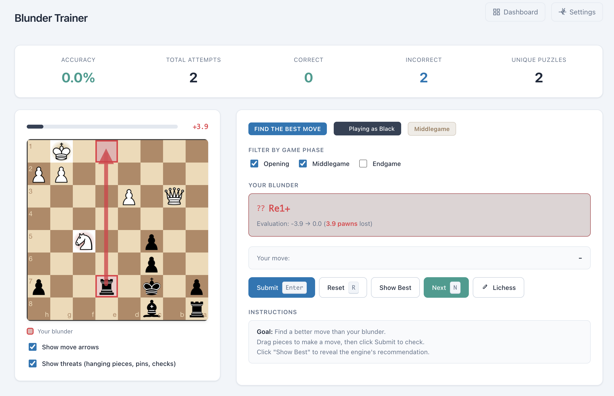
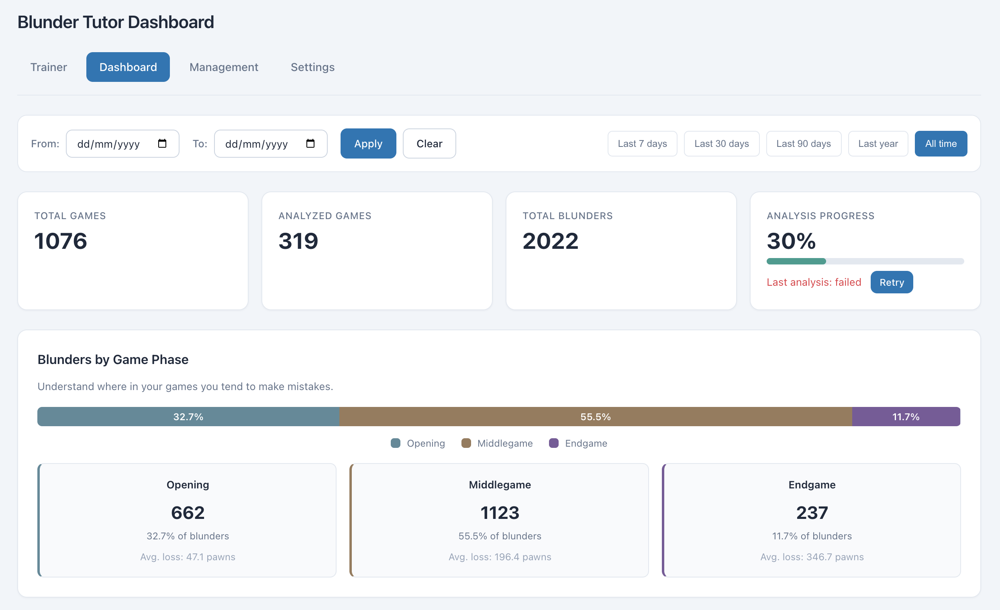
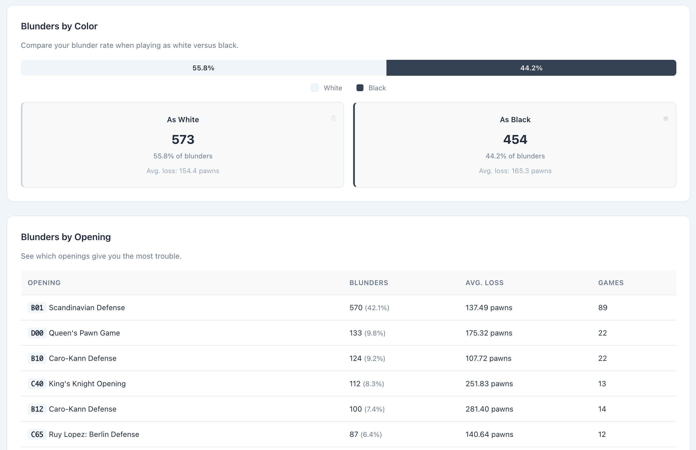

# Blunder Tutor

[](https://codecov.io/gh/MrLokans/chess-blunder-trainer)

**Stop repeating the same chess mistakes.** Blunder Tutor pulls your games from Lichess and Chess.com, finds the positions where you went wrong, and turns them into puzzles you can practice — for free, on your own machine.


## What It Does

1. **Import your games** from Lichess, Chess.com, or both
2. **Find your blunders** using Stockfish engine analysis
3. **Practice them as puzzles** — the positions where *you* made mistakes, not random tactics
4. **See where you're weakest** — dashboard shows your blunder patterns by opening, game phase, and difficulty

## Screenshots



| | |
|:-:|:-:|
|  |  |

## Why Not Just Use Lichess or Chess.com Analysis?

- **Lichess analysis** shows you the blunder but doesn't let you drill it repeatedly
- **Chess.com Game Review** is paywalled — one free review per day, then $50–150/year
- **Generic puzzle sites** train random positions, not *your* weaknesses

Blunder Tutor combines the parts that matter: finds your mistakes, turns them into drillable puzzles, and tracks which patterns you've fixed. All free, all local.

## Quick Start

```bash
docker run -p 8000:8000 -v $(pwd)/data:/app/data ghcr.io/mrlokans/blunder-tutor:latest
```

Open http://localhost:8000 and enter your chess username. That's it.

For Docker Compose, environment variables, and advanced options see [Docker Deployment Guide](docs/DOCKER.md).

## Features

- **Multi-platform import** — Lichess + Chess.com in one place
- **Stockfish 18 analysis** — configurable depth, runs locally
- **Puzzle trainer** — practice your blunders with hints and best-move arrows
- **Dashboard** — accuracy trends, blunder heatmap, opening breakdown, difficulty distribution
- **Auto-sync** — scheduled background fetch and analysis of new games
- **Self-hosted** — your data stays on your machine, no account needed
- **Multilingual** — English, Russian, and more

## Local Development

```bash
make install-dev    # Install dependencies
make test           # Run tests
make lint           # Check code style
make fix            # Auto-fix formatting
make train-ui       # Start on localhost:8000
```

Requires Python 3.13+ and Stockfish on your PATH (or set `STOCKFISH_BINARY`).

## Contributing

Issues and pull requests are welcome. Run `make install-dev` and `make test` before submitting.

## Links

- [Changelog](CHANGELOG.md)
- [Docker Deployment Guide](docs/DOCKER.md)
- [Glossary](docs/GLOSSARY.md) — chess and engine terminology
- [License](LICENSE) (AGPL-3.0)
